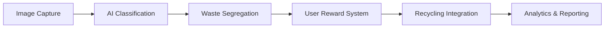

# 🌱 AI-Powered Autonomous Waste Segregation & Recycling Optimization


## 📋 Overview

A cutting-edge solution addressing India's waste management challenges through AI-powered classification, smart segregation, and incentive-based recycling systems.

### 🔍 The Problem

In India, improper waste segregation and inefficient recycling systems contribute significantly to:
- Environmental pollution
- Landfill overflow
- Resource wastage
- Health hazards

### 💡 Our Solution

Our system leverages machine learning, IoT, and gamification to create a sustainable, efficient waste management ecosystem.

---

## ✨ Key Features

### 🤖 AI-Based Waste Classification
- YOLO-based object detection identifies different waste types
- Deep learning model categorizes waste into:
  - Plastic
  - Paper
  - Organic
  - Hazardous materials
- Real-time processing with high accuracy rates

### 🗑️ Smart Waste Bins
- Automated segregation based on AI classification
- Minimal human intervention required
- IoT-enabled for real-time monitoring

### 🎮 Gamification & Rewards
- Users earn eco-points for responsible waste disposal
- Points redeemable for:
  - Discounts at partner businesses
  - Contributions to environmental causes
  - Digital badges and achievements

### 📊 Data Analytics & Reporting
- Waste generation patterns
- Recycling efficiency metrics
- Environmental impact assessments

### ♻️ Circular Economy Support
- Streamlined process for directing waste to appropriate recycling industries
- Reduced contamination in recycling streams

---

## 🛠️ Technologies Used

| Category | Technologies |
|----------|-------------|
| **Machine Learning & AI** | YOLO, TensorFlow, OpenCV |
| **IoT & Cloud** | Firebase, ESP32 Integration |
| **Backend** | Python, FastAPI |
| **Frontend** | React Native |
| **Database** | MongoDB, Firebase Realtime Database |
| **DevOps** | Docker, GitHub Actions |

---

## 📁 Repository Structure

```
.
├── carbon/                    # Dataset for training and evaluation
├── qr_codes/                  # QR codes for tracking waste bins
├── weights/                   # Model weights and checkpoints
│   └── YOLO_Custom_v8m.pt     # Custom-trained YOLO model
├── control.py                 # Hardware integration controller
├── firebaseml.py              # Firebase ML integration
├── my_trained_model.h5        # Pretrained waste classification model
├── waste_detection.log        # System activity logs
├── wastepredict.py            # Waste classification predictor
├── yolopredict.py             # YOLO-based detection script
├── yolov8n.pt                 # YOLOv8 pretrained weights
├── requirements.txt           # Project dependencies
└── README.md                  # Project documentation
```

---

## 🔄 How It Works



1. **Image Capture**: Smart waste bins capture images of disposed items
2. **AI Classification**: System classifies waste using trained ML models
3. **Segregation & Sorting**: Waste automatically sorted into designated bins
4. **User Engagement**: Users earn eco-points via mobile app
5. **Recycling Integration**: Collected waste sent to appropriate recycling facilities
6. **Analytics**: Data used to optimize the system and measure environmental impact

---

## 🚀 Getting Started

### Prerequisites

- Python 3.8+
- TensorFlow 2.8+
- CUDA-capable GPU (recommended)
- ESP32 development board (for hardware implementation)

### Installation

1. **Clone the repository**
   ```bash
   git clone https://github.com/your-username/ai-waste-segregation.git
   cd ai-waste-segregation
   ```

2. **Set up a virtual environment (recommended)**
   ```bash
   python -m venv venv
   source venv/bin/activate  # On Windows: venv\Scripts\activate
   ```

3. **Install dependencies**
   ```bash
   pip install -r requirements.txt
   ```

4. **Run the prediction script**
   ```bash
   python wastepredict.py
   ```

### Hardware Setup

For complete implementation with smart bins:

1. Connect ESP32 to the waste bin sensors
2. Configure the control.py script with your device settings
3. Deploy the mobile application for user interaction

---

## 📱 Mobile Application

Our companion mobile app allows users to:
- Track their eco-points and environmental impact
- Locate smart waste bins nearby
- Learn about proper waste disposal practices
- Redeem rewards and participate in challenges

---

## 🔮 Future Enhancements

- [ ] **Blockchain Integration**: Transparent waste tracking and verification
- [ ] **Advanced AI Models**: Expansion of waste categories with higher accuracy
- [ ] **Mobile Notifications**: Real-time feedback on waste disposal habits
- [ ] **Community Challenges**: Neighborhood competitions for waste reduction
- [ ] **Industrial Partnerships**: Direct connections with recycling facilities

---

## 🤝 Contributing

We welcome contributions to make this project better!

1. Fork the repository
2. Create your feature branch (`git checkout -b feature/amazing-feature`)
3. Commit your changes (`git commit -m 'Add some amazing feature'`)
4. Push to the branch (`git push origin feature/amazing-feature`)
5. Open a Pull Request

See [CONTRIBUTING.md](CONTRIBUTING.md) for detailed guidelines.

---

## 📄 License

This project is licensed under the MIT License - see the [LICENSE](LICENSE) file for details.

---

## 📊 Project Impact

| Metric | Target Impact |
|--------|--------------|
| Waste Correctly Segregated | +60% |
| Recycling Rate Increase | +45% |
| Landfill Diversion | +30% |
| User Engagement | 10,000+ users |

---

## 📞 Contact

- **Email**: your.email@example.com
- **Website**: [yourprojectwebsite.com](https://yourprojectwebsite.com)
- **Twitter**: [@projecthandle](https://twitter.com/projecthandle)

---

## 🙏 Acknowledgements

- [YOLOv8](https://github.com/ultralytics/ultralytics) for object detection framework
- [TensorFlow](https://www.tensorflow.org/) for machine learning capabilities
- [Firebase](https://firebase.google.com/) for cloud infrastructure
- All contributors and supporters of this project

---

<p align="center">
  <b>Join Us in Building a Cleaner Future! 🌱</b><br>
  Let's work together to create a smarter and more sustainable waste management system.
</p>
